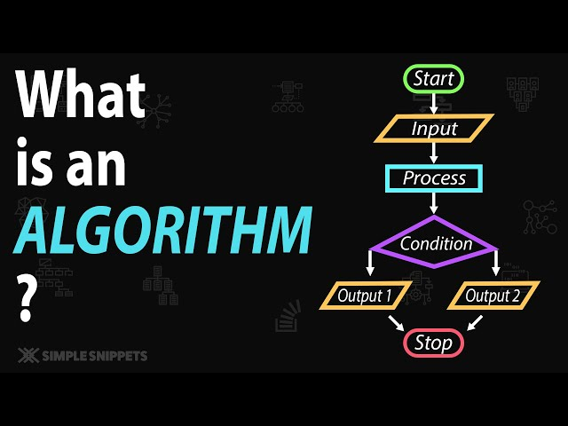

# `Giải thuật`

### **Thuật toán - `Algorithm`**
Là một tập hữu hạn chỉ các chỉ thị để được thực thi theo một thứ tự nào đó để thu được kết quả mong muốn. Giải thuật là độc lập với các ngôn ngữ lập trình, có thể triển khai trong nhiều ngôn ngữ khác nhau.

### Đặc điểm của giải thuật
Không phải tất cả các thủ tục có thể được gọi là một giải thuật. Một giải thuật nên có các đặc điểm sau:

- **Tính xác định**: Giải thuật nên rõ ràng và không mơ hồ. Mỗi một giai đoạn (hay mỗi bước) nên rõ ràng và chỉ mang một mục đích nhất định.
- **Dữ liệu đầu vào xác định**: Một giải thuật nên có 0 hoặc nhiều hơn dữ liệu đầu vào đã xác định.
- **Kết quả đầu ra**: Một giải thuật nên có một hoặc nhiều dữ liệu đầu ra đã xác định, và nên kết nối với kiểu kết quả bạn mong muốn.
- **Tính dừng**: Các giải thuật phải kết thúc sau một số hữu hạn các bước.
- **Tính hiệu quả**: Một giải thuật nên là có thể thi hành được với các nguồn có sẵn, tức là có khả năng giải quyết hiệu quả vấn đề trong điều kiện thời gian và tài nguyên cho phép.
- **Tính phổ biến**: Một giải thuật có tính phổ biến nếu giải thuật này có thể giải quyết được một lớp các vấn đề tương tự.
- **Độc lập**: Một giải thuật nên có các chỉ thị độc lập với bất kỳ phần code lập trình nào.

#### **Các loại giải thuật**
`Chương 1`: **Số học - Arithmetic**
- **isPrime** : Kiểm tra số nguyên tố
- **factorSum** : Tính tổng các ước số
- **greatestCommonPrimeDivisor** : Ước số nguyên tố chung lớn nhất
- **maxFraction** : Phân số lớn nhất
- **lastDigitDiffZero** : Số cuối cùng khác 0
- **digitsProduct** : Tích các chữ số
- **pagesNumbering** : Đánh số trang
- **primeSum** : Tổng số nguyên tố
- **numberZeroDigits** : Số chữ số 0

`Chương 2:` **Xử lý xâu - String**
- **checkStrongPassword** : Kiểm tra mật khẩu mạnh
- **amendTheSentence** : Sửa câu
- **checkPalindrome** : Kiểm tra xâu đối xứng
- **formatString** : Định dạng xâu
- **isTandemRepeat** : Kiểm tra xâu lặp
- **truncateString** : Cắt xâu
- **stringsCrossover** : Xâu chéo
- **questionCorrection** : Sửa câu hỏi
- **lineEncoding** : Mã hóa xâu

`Chương 3:` **Đếm - Counting**
- **commonCharacterCount** : Đếm ký tự chung
- **differentValuesInMultiplicationTable2** : Số lượng giá trị khác nhau trong bảng nhân
- **checkEqualFrequency** : Kiểm tra tần suất bằng nhau
- **differentSubstringsTrie** : Số lượng xâu con khác nhau
- **charactersRearrangement** : Sắp xếp ký tự
- **isPangram** : Kiểm tra Pangram
- **differentSquares** : Số lượng hình vuông khác nhau

`Chương 4:` **Ma trận - Matrix**
- **chessBoardCellColor** : Màu ô cờ
- **bishopAndPawn** : Tốt và quân tốt
- **chessKnight** : Mã đi tuần
- **bishopDiagonal** : Đường chéo tốt
- **spiralNumbers** : Số xoắn
- **sudokuChecking** : Kiểm tra Sudoku
- **findPath** : Tìm đường

`Chương 5:` **Hình học - Geometry**
- **findSquareSide** : Tìm cạnh hình vuông
- **insideCircle** : Trong hình tròn
- **isRectangle** : Hình chữ nhật
- **countTriangles** : Đếm tam giác

`Chương 6:` **Dãy số - Sequence**
- **isMonotonous** : Dãy số đơn điệu
- **isArithmeticProgression** : Cấp số cộng
- **prefixSums** : Tổng tiền tố
- **alternatingSums** : Tổng số xen kẽ
- **makeArrayConsecutive** : Tạo mảng liên tiếp
- **longestSequence** : Dãy con dài nhất
- **isGeometricProgression** : Cấp số nhân
- **isPower** : Số mũ
- **isSubsequence** : Dãy con
- **isSmooth** : Dãy mượt
- **isDivisibleBy6** : Chia hết cho 6
- **isSumOfConsecutive2** : Tổng số liên tiếp
- **isSumOfTwo** : Tổng của hai số
- **isSumOfTwoSquares** : Tổng bình phương
- **isSumOfTwoCubes** : Tổng lập phương
- **isSumOfTwoPowers** : Tổng số mũ
- **isSumOfTwoSquaresInPowers** : Tổng bình phương trong số mũ
- **isSumOfTwoCubesInPowers** : Tổng lập phương trong số mũ
- **isSumOfTwoPowersInPowers** : Tổng số mũ trong số mũ

`Chương 7:` **Đồ thị - Graph**
- **isTournament** : Giải đấu
- **componentSize** : Kích thước thành phần
- **bfsDistancesUnweightedGraph** : Khoảng cách BFS
- **isConnected** : Đồ thị liên thông
- **isTree** : Cây
- **isBipartite** : Đồ thị hai phía

`Chương 8:` **Sắp xếp - Sorting**
- **sortArray** : Sắp xếp mảng
- **sortByHeight** : Sắp xếp theo chiều cao
- **sortByLength** : Sắp xếp theo độ dài
- **sortByBits** : Sắp xếp theo số bit
- **sortByString** : Sắp xếp theo xâu
- **sortByCenter** : Sắp xếp theo trung tâm
- **sortByDistance** : Sắp xếp theo khoảng cách
- **sortByCost** : Sắp xếp theo chi phí
- **sortByWeight** : Sắp xếp theo trọng lượng
- **areSimilar** : Giống nhau
- **digitalSumSort** : Sắp xếp tổng số

`Chương 9:` **Tìm kiếm - Searching**
- **searchElement** : Tìm kiếm phần tử
- **searchElement2** : Tìm kiếm phần tử 2
- **searchElementEven** : Tìm kiếm phần tử chẵn
- **searchElementOdd** : Tìm kiếm phần tử lẻ
- **searchElementEvenIndex** : Tìm kiếm phần tử chẵn ở vị trí chẵn
- **searchElementOddIndex** : Tìm kiếm phần tử lẻ ở vị trí lẻ
- **searchElementIndex** : Tìm kiếm chỉ số phần tử
- **countElement** : Đếm phần tử
- **countPlace** : Đếm chỗ
- **countElementEven** : Đếm phần tử chẵn
- **countElementOdd** : Đếm phần tử lẻ
- **countElementEvenIndex** : Đếm phần tử chẵn ở vị trí chẵn
- **countElementOddIndex** : Đếm phần tử lẻ ở vị trí lẻ
- **beautifulArray** : Mảng đẹp
- **missingValue** : Giá trị thiếu

#### **Các loại giải thuật nâng cao**
`Chương 1:` **Tham lam - Greedy**
- **numberOfToys** : Số lượng đồ chơi
- **mettingRoom** : Phòng họp
- **maximizeSum** : Tối đa hóa tổng
- **decorateRoom** : Trang trí phòng
- **numberOfSubArray** : Số lượng mảng con

`Chương 2:` **Quay lui - Backtracking**
- **maximalMultiple** : Số lớn nhất
- **kthPermutation** : Hoán vị thứ k
- **numberOfDistinctStrings** : Số lượng xâu phân biệt
- **combinationSum** : Tổng kết hợp
- **solveSudoku** : Giải Sudoku

`Chương 3:` **Quy hoạch động - Dynamic Programming**
- **fib** : Dãy Fibonacci
- **maximumNonAdj** : Tổng lớn nhất không kề nhau
- **easyLego** : Lego dễ
- **lds1** : Dãy con không giảm dài nhất
- **lds2** : Dãy con không giảm dài nhất 2

`Chương 4:` **Chia để trị - Divide and Conquer**
- **countInversions** : Đếm số lượt đảo
- **sumOfOnes** : Tổng số 1
- **similarStrings** : Xâu giống nhau
- **countOccurrencePairs** : Đếm cặp xuất hiện

`Chương 5:` **DFS & BFS - Depth First Search & Breadth First Search**
- **advanced algorithms 1**
- **advanced algorithms 2**
- **advanced algorithms 3**
- **advanced algorithms 4**
- **rotAllApple** : Quay tất cả táo

`Chương 6:` **Đồ thị cây - Tree**
- **lca** : Tổ tiên chung thấp nhất
- **organizeParty** : Tổ chức tiệc
- **cutTheTree** : Cắt cây
- **numberOfPaths** : Số lượng đường đi
- **kPath** : Đường đi k

### **Mục tiêu của việc học giải thuật**
Cung cấp kiến thức chuyên sâu về các thuật toán phức tạp.

Nâng cao khả năng tư duy logic và kỹ năng giải quyết vấn đề.

Giúp bạn tự tin áp dụng các thuật toán vào các dự án thực tế và nghiên cứu.

Cải thiện khả năng lập trình với những thuật toán mạnh mẽ để giải quyết các bài toán lập trình phức tạp.

### **Tài liệu học giải thuật**
https://codelearn.io/learning/thuat-toan-can-ban?tab=introduce